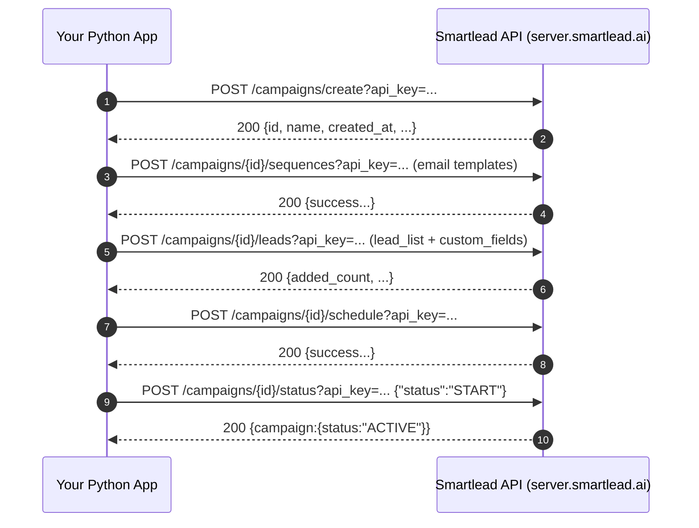

# Deep research report: Smartlead API documentation and Python implementation for campaign automation and custom email sending

## Executive summary

Smartlead’s public API documentation is hosted at the SmartLead API developer docs site and describes a REST API whose primary authentication mechanism is an API key passed as the `api_key` query parameter (or, for some write operations, included in the JSON body). citeturn9search10turn8search13 The core “start campaigns and send personalized outreach” workflow is: create a campaign (initially **DRAFTED**), configure sequences (email copy + delays), link sender email accounts, add/import leads with `custom_fields`, configure sending schedule, then start the campaign by updating status. citeturn18view0turn25view3turn20view0turn25view2turn19view2

Smartlead provides two conceptually different mechanisms related to “sending emails via API”:

- **Campaign-based sending**: you programmatically create campaigns, sequences, leads, and schedules, and Smartlead sends emails according to campaign logic (rotation, limits, tracking). citeturn17search9turn17search7turn19view2  
- **One-off sending**: the API reference includes a “Send Single Email” utility endpoint at `/api/v1/send-email/initiate`, but the public page is sparse and does not clearly document the required payload or subsequent steps; treat key details as **unspecified** unless confirmed by Smartlead support or additional official docs. citeturn15view0turn16view0

For inbound engagement tracking and near-real-time integrations, Smartlead supports webhooks. The documentation appears to describe **two webhook surfaces**:
- **Global webhooks** under `/api/v1/webhooks` with event types like `EMAIL_SENT`, `EMAIL_OPENED`, `EMAIL_CLICKED`, `EMAIL_REPLIED`, `EMAIL_BOUNCED`, `LEAD_UNSUBSCRIBED`, etc., along with retry guidance and payload examples. citeturn27view0turn17search10  
- **Campaign-scoped webhooks** under `/api/v1/campaigns/{campaign_id}/webhooks` with event type names like `LEAD_OPENED` / `LEAD_CLICKED` / `LEAD_REPLIED` / `LEAD_BOUNCED` / `LEAD_UNSUBSCRIBED`. This naming differs from the global webhook docs, so you should validate expected event names in test payloads before production logic depends on them. citeturn21view0turn27view0turn17search10

Rate limits are documented at the plan tier level (Standard vs Pro vs Enterprise custom) and apply per API key across endpoints. citeturn9search7 Additionally, Smartlead provides both SMTP/IMAP account creation endpoints (credentials provided in request body) and OAuth email account creation endpoints where you provide OAuth token material (access/refresh token, expiry, etc.). citeturn17search3turn28view0

For Python integrations, there is no official Python SDK evident in the official docs; Smartlead’s docs provide Python `requests` examples throughout. citeturn9search1turn5search8turn25view2 Community tooling includes a Python CLI package on entity["company","PyPI","python package index"] (`smartlead-cli`) and at least one third-party CLI/MCP project on entity["company","GitHub","code hosting platform"] (TypeScript). citeturn7view0turn6view2

## Official documentation map and developer access points

### Primary documentation portals

The official developer documentation is hosted at the SmartLead API documentation site with sections for Introduction, Quickstart, Authentication, API Reference, Webhooks, and multiple operational guides (rate limits, error handling, warmup, lead management). citeturn17search9turn9search1turn5search8

The Smartlead Help Center also maintains an “Full API Documentation” article that points developers to the API base URL and describes core capabilities (campaigns, leads, email accounts, analytics, webhooks). citeturn10search4

### Base URLs and “multi-service” layout

Smartlead’s API reference uses multiple hostnames depending on product surface:

- Core campaign/lead/email operations use:  
  `https://server.smartlead.ai/api/v1` (documented across multiple endpoints). citeturn18view0turn9search10turn17search3
- Smart Delivery (deliverability testing suite) uses:  
  `https://smartdelivery.smartlead.ai/api/v1/...` and is explicitly described as a Smartlead deliverability testing suite; some parts indicate you should contact support for access/API details. citeturn4search14turn11search7
- Smart Prospect (contact discovery/enrichment/search-email-leads) uses:  
  `https://prospect-api.smartlead.ai/api/v1/search-email-leads/...` in the API reference. citeturn11search6turn8search9

This matters operationally: your Python client should support multiple base URLs (or separate client objects) if you use Smart Prospect or Smart Delivery features.

### Visual reference

image_group{"layout":"carousel","aspect_ratio":"16:9","query":["SmartLead API documentation api.smartlead.ai screenshot","Smartlead dashboard app.smartlead.ai API keys settings screenshot","Smartlead webhook integration guide screenshot"],"num_per_query":1}

## Authentication and authorization methods

### API authentication: API keys (officially documented)

SmartLead API authentication is via API key; the docs recommend passing it as a query parameter (`api_key=...`) and also describe including it in the request body for some POST/PATCH requests. citeturn9search10

**Auth error shape (example)**: the Auth page shows a `401 Unauthorized` response with a structured `"error": {"code": "UNAUTHORIZED", ...}` object. citeturn9search10

### OAuth in Smartlead: for connecting sender mailboxes, not for API auth

Smartlead’s API reference includes an **“Add OAuth Email Account”** endpoint (`POST /api/v1/email-accounts/save-oauth`) that accepts an OAuth token bundle (scope, token_type, access_token, refresh_token, expiry_date) and a mailbox “type” (example: `GMAIL`). citeturn28view0

This is separate from API authentication; your API requests still authenticate with `api_key`, but OAuth material is used to authorize Smartlead to access the mailbox provider.

### Authentication comparison table

| Topic | Mechanism | Where used | Concrete example |
|---|---|---|---|
| API authentication | API key in query string (`api_key`) | All endpoints | `GET /campaigns/?api_key=YOUR_API_KEY` citeturn9search10turn9search0 |
| API authentication (alternate) | API key in JSON request body | Some POST/PATCH | Docs show an example body containing `"api_key": "...", ...` citeturn9search10 |
| Mailbox authorization | OAuth token bundle in request body (`token.access_token`, `refresh_token`, `expiry_date`) | `POST /email-accounts/save-oauth` | Example request body including `type: "GMAIL"` and a nested `token` object. citeturn28view0 |

### Exact request examples (official patterns)

**API key in query parameter (recommended)** citeturn9search10turn9search0
```bash
curl -X GET "https://server.smartlead.ai/api/v1/campaigns/?api_key=YOUR_API_KEY"
```

**Add OAuth email account (Gmail example structure)** citeturn28view0
```bash
curl -X POST "https://server.smartlead.ai/api/v1/email-accounts/save-oauth?api_key=YOUR_KEY" \
  -H "Content-Type: application/json" \
  -d '{
    "from_name": "John Doe",
    "from_email": "john@gmail.com",
    "username": "john@gmail.com",
    "type": "GMAIL",
    "token": {
      "scope": "https://mail.google.com/",
      "token_type": "Bearer",
      "access_token": "ya29....",
      "refresh_token": "1//0g....",
      "expiry_date": 1732627200000
    },
    "warmup_enabled": true,
    "total_warmup_per_day": 20,
    "daily_rampup": 2,
    "max_email_per_day": 50
  }'
```

## Core endpoints for campaigns, sequences, leads, lists, sending, scheduling, tracking, unsubscribes

### Campaign creation, configuration, scheduling, starting/stopping

**Create campaign**: `POST /api/v1/campaigns/create` with required field `name`; docs state campaigns are created with default settings in **DRAFTED** status. citeturn18view0

**Update campaign schedule**: `POST /api/v1/campaigns/{campaign_id}/schedule` with required `schedule` object containing `timezone`, `days`, `start_hour`, `end_hour`, and optionally `min_time_btw_emails`. citeturn20view0

**Update campaign status (start/pause/stop)**: `POST /api/v1/campaigns/{campaign_id}/status`. The API reference indicates valid request values include `START`, `PAUSED`, and `STOPPED`, and explicitly notes “Use `START` not `ACTIVE` when activating a campaign.” citeturn19view2turn19view0  
However, the Quickstart page shows a different example (`PATCH` and `{"status":"ACTIVE"}`), so you should treat this as a documentation mismatch and validate behavior in your environment. citeturn17search6turn19view2

**Campaign settings**: `POST /api/v1/campaigns/{campaign_id}/settings` includes tracking settings, limits, stop rules, AI matching, plain text mode, follow-up percentage, and unsubscribe text. citeturn11search9turn8search2

### Email “templates”: sequences and variants (campaign-based sending)

Smartlead’s API models email content primarily via **email sequences**: ordered steps (seq 1, seq 2, …) with delay configuration, `subject`, and `email_body` (HTML supported), plus optional A/B variants described in docs. citeturn25view3turn9search5turn9search1

The Help Center separately discusses “templates” as an authoring feature in the UI (sequence editor), but this is not documented as a standalone “template CRUD” API surface in the public API reference. Treat “template endpoints” as **not publicly documented** unless you confirm otherwise. citeturn10search13turn10search18turn25view3

### Lead and contact management

**Add leads to campaign**: `POST /api/v1/campaigns/{campaign_id}/leads` with required `lead_list` array; the API reference states **max 400 leads** per request and lists multiple optional lead fields. citeturn25view2  
Official examples show including `custom_fields` per lead, which is the canonical mechanism for personalization variables. citeturn17search6turn5search8

**Get campaign leads with engagement filters**: `GET /api/v1/campaigns/{campaign_id}/leads` supports pagination and filtering by `emailStatus` values such as `is_opened`, `is_clicked`, `is_replied`, `is_bounced`, `is_unsubscribed`, etc. citeturn11search11turn11search10

**Unsubscribe**:
- Campaign-scoped unsubscribe: `POST /api/v1/campaigns/{campaign_id}/leads/{lead_id}/unsubscribe` returns a message like “Lead unsubscribed successfully.” citeturn24view0  
- Global unsubscribe: `POST /api/v1/leads/{lead_id}/unsubscribe`. Docs also explain behavior: the lead is flagged `is_unsubscribed=true`, remains in campaigns, but will not receive email from any campaign. citeturn25view1

For “contacts” beyond imported leads, the API navigation indicates a “Smart Prospect” set of endpoints (search contacts, fetch contacts, find emails, saved searches, etc.). Only some are easily discoverable in the sources examined here (e.g., Search Analytics), so treat detailed request/response schemas for the rest as **unspecified** unless you consult those specific API reference pages. citeturn14view0turn11search6turn8search9

### Lists/segments: Lead Lists APIs

Smartlead provides a “Lead Lists” API surface (organize/segment leads outside campaigns), including:

- Create lead list: `POST /api/v1/lead-list/` with body `{ "listName": "..." }`. citeturn22view0  
- Import leads to list: `POST /api/v1/lead-list/{id}/import` with `leadList` array + `fileName` and optional `csvSettings.ignoreGlobalBlockList`. citeturn23view0  
- Push leads to campaign: `POST /api/v1/leads/push-to-campaign` supports `campaignId` or `campaignName` (create if missing), and `action` (`copy`/`move`). Lead selection can be `listId`, explicit `leadIds`, or `allLeads`. citeturn23view2

### Tracking opens/clicks/replies and analytics endpoints

Smartlead supports tracking and reporting through multiple mechanisms:

- **Campaign analytics endpoint**: `Get Campaign Analytics` returns aggregate metrics such as `total_sent`, `total_opened`, `total_clicked`, `total_replied`, and rates (open/click/reply/bounce/unsubscribe). citeturn8search14
- **Webhook events**: event types include opened/clicked/replied/bounced/unsubscribed and come with payload examples. citeturn17search10turn27view0
- **Lead listing filters**: query filters for opened/clicked/replied allow you to “pull” engagement segments without webhooks (polling-style). citeturn11search11turn11search10

### “Sending emails” endpoints: what is actually documented

| Sending mode | How it works | Relevant endpoints | Documentation status |
|---|---|---|---|
| Campaign-based send (recommended for outreach) | Smartlead sends based on schedule, sequences, lead state, rotation | Create campaign; update sequences; add leads; update schedule; update status START; analytics | Well documented in API reference and guides. citeturn18view0turn25view3turn25view2turn20view0turn19view2turn8search14 |
| Test send (validate content) | Send a test email for a sequence using a lead’s data | `POST /campaigns/{campaign_id}/send-test-email` with `leadId`, `sequenceNumber`, etc. | Documented with required fields. citeturn17search0turn4search22 |
| One-off “single email” | A transactional/one-off email outside campaigns | `POST /send-email/initiate` | Public doc page is sparse and does not clearly specify payload; treat full schema as unspecified. citeturn15view0turn16view0 |

## Rate limits, error codes, request/response conventions, and known documentation inconsistencies

### Rate limits

Smartlead documents per-API-key limits by subscription tier and states limits apply to your API key across all endpoints combined. citeturn9search7

The rate limit guide provides an explicit structure (Requests per minute/hour, plus burst limit): Standard 60/min and 1,000/hour (burst 10 req/s); Pro 120/min and 3,000/hour (burst 20 req/s); Enterprise custom. citeturn9search7

Some community tooling repeats a different “10 requests / 2 seconds” number; treat that as potentially outdated or a narrower constraint (e.g., a legacy burst limiter) unless Smartlead confirms. citeturn6view2

### Common headers and payload expectations

Across endpoints, the docs consistently show:
- JSON requests with `Content-Type: application/json` for POST/PUT/PATCH. citeturn18view0turn20view0turn28view0
- API key passed as query param (`?api_key=...`). citeturn9search10turn18view0

### Error codes and validation patterns

Many API reference pages list an overlapping set of response codes:
- `400 Bad Request` (malformed parameters/body)
- `401 Unauthorized` (invalid/missing API key)
- `404 Not Found` (resource does not exist or not accessible)
- `422 Validation Error` (schema/type/constraint failure)
- `429 Rate Limit Exceeded`
- `500` / `503` server-side issues citeturn15view0turn11search3turn18view0turn19view2

The Authentication page shows a representative `401` JSON shape with `success: false` and an `error` object. citeturn9search10

### Documentation inconsistencies you should design around

There are at least two notable mismatches in official pages:

- **Campaign start status**: Quickstart shows `PATCH .../status` with `{"status":"ACTIVE"}`, but the API reference for “Update Campaign Status” states you should pass `{"status":"START"}` (and uses `POST`). citeturn17search6turn19view2turn19view0  
  Practical recommendation: implement a thin abstraction (e.g., `start_campaign(campaign_id)`) that can try `START` first and fall back only if you see a documented/consistent error in your account, and log the server response.

- **Webhook event naming**: campaign webhook docs show `LEAD_OPENED` / `LEAD_CLICKED`-style names, while global webhook docs and events reference show `EMAIL_OPENED` / `EMAIL_CLICKED`. citeturn21view0turn17search10turn27view0  
  Practical recommendation: treat event type mapping as configuration and confirm by inspecting payloads from a test webhook.

## Webhooks and tracking integration design

Smartlead’s webhook documentation emphasizes using webhooks instead of polling for events (replies, bounces, unsubscribes, sends) and provides example code in Python (Flask) and Node/Express. citeturn27view0turn17search1

### Global webhook flow (documented)

Key operational guidance includes:
- Always respond `200` within **30 seconds**.
- If your endpoint times out or errors, Smartlead retries up to **3 times** with exponential backoff (1 minute, 5 minutes, 30 minutes). citeturn27view0
- Implement idempotency by checking `message_id` or timestamps to avoid double-processing if a retry happens. citeturn27view0

**Webhook payload fields** vary by event type; e.g., `reply_body` exists for reply events. citeturn27view0turn17search10

### Campaign-scoped webhooks (documented separately)

Campaign webhook configuration uses `POST /api/v1/campaigns/{campaign_id}/webhooks` with body fields:
- `id` (null for create; number for update)
- `name`
- `webhook_url`
- `event_types` array (examples in docs include lead-event naming). citeturn21view0turn21view2

### Mermaid diagrams



```mermaid
flowchart LR
  A[Smartlead sends email / receives engagement] -->|Webhook POST| B[Your webhook endpoint]
  B --> C{Validate request\n(idempotency + auth checks)}
  C -->|new event| D[Update CRM / DB\n+ notify team]
  C -->|duplicate| E[No-op]
  B -->|HTTP 200 within 30s| A
  B -->|timeout / non-200| F[Smartlead retries\n(1m, 5m, 30m)]
  F --> B
```

### Webhook security notes

The webhook guide mentions “security verification,” but the visible sections and examples in the examined sources do not clearly document an HMAC signature header, shared secret, or public key verification procedure. Treat webhook signature verification specifics as **unspecified** until you confirm in official Smartlead docs or support. citeturn27view0

## Python implementation details, SDKs, and sample scripts

### Python integration options: what exists publicly

| Option | What it is | Strengths | Caveats |
|---|---|---|---|
| Raw `requests` integration (official examples) | Implement HTTP calls directly | Most transparent; aligns with docs examples | You own retries, errors, rate limiting, idempotency. citeturn9search1turn25view2turn27view0 |
| `smartlead-cli` on entity["company","PyPI","python package index"] | Community Python CLI wrapper (Typer-based) | Useful for scripting + “raw” fallback for undocumented endpoints; has release history | Not official; verify maintenance/security for production. citeturn7view0 |
| CLI/MCP project on entity["company","GitHub","code hosting platform"] (TypeScript) | Third-party CLI and MCP server | Broad command surface + automation for agents | Not Python; not official; separate install and runtime. citeturn6view2 |

### Minimal Python client skeleton with retries and rate-limit handling

The official rate limit guide provides tier limits and describes burst behavior; the webhook guide separately describes webhook retries. For API calls, you should implement backoff on `429` and transient errors. citeturn9search7turn15view0turn27view0

```python
import os
import time
from typing import Any, Dict, Optional
import requests

class SmartleadAPIError(Exception):
    pass

class SmartleadClient:
    def __init__(self, api_key: str, base_url: str = "https://server.smartlead.ai/api/v1", timeout: int = 30):
        self.api_key = api_key
        self.base_url = base_url.rstrip("/")
        self.timeout = timeout
        self.session = requests.Session()
        self.session.headers.update({"Content-Type": "application/json"})

    def _request(self, method: str, path: str, *, params: Optional[Dict[str, Any]] = None,
                 json: Optional[Dict[str, Any]] = None, retries: int = 5) -> Any:
        url = f"{self.base_url}/{path.lstrip('/')}"
        params = dict(params or {})
        params["api_key"] = self.api_key  # official auth mechanism

        backoff = 1.0
        last_exc: Optional[Exception] = None

        for attempt in range(retries):
            try:
                resp = self.session.request(method, url, params=params, json=json, timeout=self.timeout)

                # Rate limiting
                if resp.status_code == 429:
                    time.sleep(backoff)
                    backoff = min(backoff * 2, 30)
                    continue

                # Auth / validation / not found
                if resp.status_code >= 400:
                    raise SmartleadAPIError(f"HTTP {resp.status_code}: {resp.text}")

                # Usually JSON responses
                if resp.headers.get("Content-Type", "").startswith("application/json"):
                    return resp.json()
                return resp.text

            except (requests.RequestException, SmartleadAPIError) as e:
                last_exc = e
                # Retry only for network/transient errors; keep it simple here.
                time.sleep(backoff)
                backoff = min(backoff * 2, 30)

        raise SmartleadAPIError(f"Request failed after {retries} attempts: {last_exc}")

def main():
    api_key = os.environ["SMARTLEAD_API_KEY"]
    sl = SmartleadClient(api_key)

    # 1) Create campaign (DRAFTED by default)
    campaign = sl._request("POST", "/campaigns/create", json={"name": "API Outreach Campaign"})
    campaign_id = campaign.get("id") or campaign.get("campaign", {}).get("id")
    print("Campaign created:", campaign_id, campaign)

if __name__ == "__main__":
    main()
```

### End-to-end example: create campaign, set sequences (templates), add leads, schedule, start

Below is a composite workflow built from official endpoint definitions and official examples. Key details:
- Campaign create: `POST /campaigns/create` citeturn18view0  
- Sequences: `POST /campaigns/{id}/sequences` with `sequences[]` and `seq_delay_details.delay_in_days` citeturn25view3turn9search1  
- Add leads: `lead_list` max 400; personalization via `custom_fields` citeturn25view2turn17search6turn5search8  
- Schedule: timezone/days/hours + optional min time between emails citeturn20view0  
- Start: `POST /campaigns/{id}/status` with `status: START` citeturn19view2turn19view0  

```python
import os
import requests

API_KEY = os.environ["SMARTLEAD_API_KEY"]
BASE_URL = "https://server.smartlead.ai/api/v1"

def post(path: str, payload=None):
    return requests.post(
        f"{BASE_URL}{path}",
        params={"api_key": API_KEY},
        json=payload or {},
        timeout=30,
    )

# 1) Create a campaign
campaign_resp = post("/campaigns/create", {"name": "Q2 API Outreach"}).json()
campaign_id = campaign_resp.get("id")
print("Created campaign:", campaign_id)

# 2) Define sequences (email templates + delays)
sequences_payload = {
    "sequences": [
        {
            "id": None,
            "seq_number": 1,
            "subject": "Quick question, {{first_name}}",
            "email_body": "<p>Hi {{first_name}},</p><p>Noticed {{company_name}}...</p>",
            "seq_delay_details": {"delay_in_days": 0},
        },
        {
            "id": None,
            "seq_number": 2,
            "subject": "Following up, {{first_name}}",
            "email_body": "<p>Just checking back in...</p>",
            "seq_delay_details": {"delay_in_days": 3},
        },
    ]
}
seq_resp = post(f"/campaigns/{campaign_id}/sequences", sequences_payload).json()
print("Sequences response:", seq_resp)

# 3) Add leads with custom_fields for personalization
leads_payload = {
    "lead_list": [
        {
            "email": "jane.doe@example.com",
            "first_name": "Jane",
            "last_name": "Doe",
            "company_name": "Acme Corp",
            "custom_fields": {"job_title": "CEO", "industry": "SaaS"},
        },
        {
            "email": "john.smith@example.com",
            "first_name": "John",
            "company_name": "Example Inc",
            "custom_fields": {"job_title": "Head of Sales"},
        },
    ]
}
leads_resp = post(f"/campaigns/{campaign_id}/leads", leads_payload).json()
print("Leads added:", leads_resp)

# 4) Schedule sending window
schedule_payload = {
        "timezone": "America/New_York",
        "days": [1, 2, 3, 4, 5],
        "start_hour": "09:00",
        "end_hour": "17:00",
	"min_time_btw_emails": 120,
}
schedule_resp = post(f"/campaigns/{campaign_id}/schedule", schedule_payload).json()
print("Schedule response:", schedule_resp)

# 5) Start campaign (API reference says use START not ACTIVE)
status_resp = post(f"/campaigns/{campaign_id}/status", {"status": "START"}).json()
print("Status response:", status_resp)
```

### Testing and QA: send a test email

Smartlead documents a “Send Test Email” endpoint that uses `leadId` for personalization and a `sequenceNumber` selector. citeturn17search0turn4search22
```python
import requests, os

API_KEY = os.environ["SMARTLEAD_API_KEY"]
BASE_URL = "https://server.smartlead.ai/api/v1"

campaign_id = 123
payload = {"leadId": 789, "sequenceNumber": 1, "customEmailAddress": "test@mycompany.com"}

resp = requests.post(
    f"{BASE_URL}/campaigns/{campaign_id}/send-test-email",
    params={"api_key": API_KEY},
    json=payload,
    timeout=30
).json()

print(resp)
```

### Working with lead lists (segments) in Python

Official docs show:
- importing leads into a list with a batch name (`fileName`) and `csvSettings.ignoreGlobalBlockList` citeturn23view0turn12search2  
- pushing list leads to a campaign with `action` copy/move and selection criteria citeturn23view2  

### Webhook receiver sample (from docs) and idempotency note

The webhook guide provides Flask sample logic and recommends idempotency protections using `message_id` or timestamp-based dedupe. citeturn27view0

Because Smartlead may retry webhook deliveries, your receiver should store processed `(event_type, message_id)` pairs or equivalent identifiers and treat repeats as no-ops.

### Community tooling notes

- `smartlead-cli` on entity["company","PyPI","python package index"] is a Python CLI that stores config in `~/.config/smartlead-cli/config.toml`, supports “raw request” for endpoints not explicitly wrapped, and documents webhook event types for its own “upsert” helper (which may not match official naming exactly). citeturn7view0  
- A third-party TypeScript CLI/MCP project on entity["company","GitHub","code hosting platform"] lists many commands and states base URL and query-param auth usage. citeturn6view2

## Best practices, UI vs API gaps, security, compliance, and support

### Personalization best practices

Smartlead’s official API examples emphasize `custom_fields` on lead objects and templating placeholders in sequence subject/body (e.g., `{{first_name}}`, `{{company_name}}`). citeturn17search6turn5search8turn6view2  
Operationally, personalization should be coupled with deduping and validation: verify emails before sending and sanitize/normalize lead data (e.g., lowercasing emails). Verification exists as an API utility endpoint (`POST /verify-emails`). citeturn14view0turn7view0

### Batching and throttling strategy

Combine three constraints into your sending pipeline:

- API-level limits: plan-based limits (requests per minute/hour and burst). citeturn9search7  
- Endpoint-level batch sizes: add-leads endpoint indicates max **400 leads** per call. citeturn25view2  
- Business constraints: schedule window + min time between emails + daily caps. citeturn20view0turn11search9  

A practical pattern:
- Put leads into a queue.
- Batch into chunks of ≤400 for `/campaigns/{id}/leads`.
- Sleep/retry on `429`.
- Consider a gradual ramp-up via sending limits and warmup settings.

### Handling bounces, spam complaints, and suppression

Smartlead offers:
- webhook events for bounces and unsubscribes (global webhook docs include `EMAIL_BOUNCED` and `LEAD_UNSUBSCRIBED`; events reference includes `EMAIL_UNSUBSCRIBED`). citeturn27view0turn17search10  
- a domain/email block list management API (get/add/delete) that records the source (manual/bounce/spam) and supports pagination. citeturn11search3turn12search2  
- lead listing filters (`emailStatus=is_bounced`, `emailStatus=is_unsubscribed`) to audit and export segments. citeturn11search10turn11search11  

This allows a standard bounce/unsubscribe pipeline:
1) receive `EMAIL_BOUNCED` or `LEAD_UNSUBSCRIBED` webhook,  
2) mark lead suppressed in your CRM,  
3) optionally add domain/email to block list if policy dictates,  
4) stop outreach automatically via Smartlead unsub flags and status filters. citeturn27view0turn25view1turn11search3

### UI vs API feature gaps and restricted surfaces

Observed gaps/constraints from public sources:

- **“Send Single Email” utility endpoint appears under-documented**: the page shows the endpoint path and response codes but does not clearly specify required request body despite describing attachments and transactional sending. Treat as unspecified without support confirmation. citeturn15view0turn16view0
- **Smart Delivery API access is partially gated**: some Smart Delivery pages state the suite exists and instruct contacting support for access and details. citeturn4search14turn11search7
- **Templates as a UI feature**: Smartlead Help Center describes creating/using templates within the Sequence UI, but the public API does not clearly expose template library management as first-class endpoints. citeturn10search13turn10search18turn25view3
- **Webhook naming mismatch** between campaign-scoped and global docs likely causes integration friction unless you test your own payloads. citeturn21view0turn27view0turn17search10

### Support channels and developer contact points

The developer docs navigation exposes:
- “Community” which links to entity["company","Discord","messaging platform"], and
- “Support” and dashboard links. citeturn27view0turn14view0

The Smartlead API docs and Smart Delivery pages explicitly reference contacting support via email (support@smartlead.ai) for certain functionality/access. citeturn9search1turn4search14turn17search6

### Changelogs

- The official API docs site does not expose a clear “API changelog” page in the sources reviewed here; treat official API changelog availability as **unspecified**. citeturn17search9turn5search8  
- Community tool changelogs exist via entity["company","PyPI","python package index"] release history for `smartlead-cli` (example: versions and release dates). citeturn7view0  
- The third-party TypeScript CLI repository has standard repository history and README documentation. citeturn6view2

### Security and compliance notes

Smartlead’s official docs emphasize API key secrecy (“equivalent to your password”) and recommend secure storage (env vars / secrets managers) and rotation. citeturn9search10turn5search8

On compliance:
- Smartlead provides Help Center and blog material on GDPR and cold-email compliance and describes unsubscribe behavior (global vs campaign-level unsubscribing). citeturn26search0turn26search1turn26search15turn25view1turn24view0  
- Smartlead publishes a privacy policy and terms/conditions pages. citeturn26search2turn26search11

Operational best practice for compliance when using the API:
- Always include an unsubscribe mechanism and honor unsubscribe flags (Smartlead supports both campaign and global unsub endpoints and webhook events). citeturn25view1turn24view0turn27view0  
- Treat webhook unsubscribe events as authoritative for suppression lists (even if you also poll). citeturn27view0turn17search10  
- Align your lead storage and deletion practices with your own GDPR/CAN-SPAM obligations; Smartlead Help Center includes GDPR-oriented guidance and data-handling implications (e.g., effects of deleting leads). citeturn26search0turn26search12

## Source index with annotated notes and convenience links

### Annotated source table

| Source | Category | What it contains (annotated notes) |
|---|---|---|
| SmartLead API Introduction citeturn17search9turn8search13 | Official developer docs | Overview of API capabilities and navigation to Quickstart/Auth/Webhooks; establishes the developer doc portal. |
| Authentication citeturn9search10 | Official developer docs | API key auth model, query-param and request-body method, example `401` error shape, best practices for key handling. |
| Quickstart citeturn17search6turn9search1 | Official developer docs | End-to-end workflow examples (campaign creation, adding email account, adding leads, sequences). Also contains a start-campaign example that conflicts with API reference (PATCH/ACTIVE). |
| Create Campaign citeturn18view0 | Official API reference | `POST /campaigns/create`, required `name`, example response, DRAFTED creation note. |
| Update Campaign Status citeturn19view2turn19view0 | Official API reference | `POST /campaigns/{id}/status` and the critical note: use `START`, not `ACTIVE`, to activate. |
| Update Campaign Schedule citeturn20view0 | Official API reference | Required fields sent flat in body: timezone/days/start/end (+ optional min time). |
| Update Campaign Sequences citeturn25view3turn9search5 | Official API reference | Sequence object schema (`seq_number`, `email_body`, delay); notes about creating/updating sequences. |
| Add Leads to Campaign citeturn25view2turn17search6turn5search8 | Official API reference + guides | `lead_list` schema, max 400 leads per call; examples show `custom_fields` for personalization. |
| Get Campaign Leads (filters) citeturn11search11turn11search10 | Official API reference | Pagination and filtering including email engagement states (opened/clicked/replied/bounced/unsubscribed). |
| Campaign Analytics citeturn8search14 | Official API reference | Example aggregated metrics and rates (open/click/reply/bounce/unsubscribe). |
| Webhook Integration Guide citeturn27view0 | Official developer docs | Global webhook endpoint usage, payload format, retry schedule, idempotency advice; code samples including CRM sync examples referencing entity["company","HubSpot","crm platform"] and entity["company","Slack","collaboration platform"]. |
| Webhook Events Reference citeturn17search10turn13search6 | Official API reference | Event type definitions and payload examples (`EMAIL_OPENED`, `EMAIL_CLICKED`, etc.). |
| Create/Update Campaign Webhook citeturn21view0turn21view2 | Official API reference | Campaign-scoped webhook endpoint (`/campaigns/{id}/webhooks`) and event type list (lead-prefixed naming). |
| Unsubscribe endpoints citeturn24view0turn25view1 | Official API reference | Campaign-specific unsub endpoint and global unsub endpoint, plus behavior notes for global unsub. |
| Lead Lists endpoints citeturn22view0turn23view0turn23view2 | Official API reference | List creation; importing leads to lists; pushing/copying/moving leads into campaigns (segments). |
| Add SMTP Email Account citeturn17search3 | Official API reference | SMTP/IMAP account creation schema and success/connection failure response patterns; warmup settings fields. |
| Add OAuth Email Account citeturn28view0 | Official API reference | OAuth token bundle schema and endpoint path (`/email-accounts/save-oauth`), token refresh positioning. |
| Rate Limits Guide citeturn9search7 | Official developer docs | Tier-specific RPM/RPH and burst limits; clarifies limits are per API key across endpoints. |
| Verify Email utility citeturn14view0 | Official API reference | `POST /verify-emails` utility presence, response codes (schema details not fully expanded in excerpt). |
| Send Single Email utility citeturn15view0turn16view0 | Official API reference | Endpoint path exists (`/send-email/initiate`) but request schema is unclear; treat as under-documented publicly. |
| Full API Documentation (Help Center) citeturn10search4 | Official help center | Narrative overview of API feature scope and base URL. |
| Unsubscribe behavior (Help Center) citeturn26search15 | Official help center | Conceptual explanation of unsubscribe modes (global vs localized). |
| GDPR / compliance articles citeturn26search0turn26search1turn26search2turn26search11 | Official help center + blog | GDPR checklist, cold email compliance discussion, privacy policy, and terms/conditions references. |
| `smartlead-cli` on entity["company","PyPI","python package index"] citeturn7view0 | Community tooling | Install instructions (`pip install smartlead-cli`), config layout, command coverage, and release history. |
| Third-party smartlead CLI/MCP on entity["company","GitHub","code hosting platform"] citeturn6view2 | Community tooling | Broad CLI command list, auth patterns, rate-limit note (may differ from official), automation examples. |

### Convenience URL list (copy/paste)

```text
https://api.smartlead.ai/
https://api.smartlead.ai/authentication
https://api.smartlead.ai/quickstart
https://api.smartlead.ai/guides/getting-started
https://api.smartlead.ai/guides/rate-limits
https://api.smartlead.ai/guides/webhook-integration
https://api.smartlead.ai/api-reference/campaigns/create
https://api.smartlead.ai/api-reference/campaigns/update-status
https://api.smartlead.ai/api-reference/campaigns/update-schedule
https://api.smartlead.ai/api-reference/campaigns/update-sequences
https://api.smartlead.ai/api-reference/campaigns/add-leads
https://api.smartlead.ai/api-reference/campaigns/save-webhooks
https://api.smartlead.ai/api-reference/webhooks/events
https://api.smartlead.ai/api-reference/lead-lists/create
https://api.smartlead.ai/api-reference/lead-lists/import-leads
https://api.smartlead.ai/api-reference/lead-lists/push-to-campaign
https://api.smartlead.ai/api-reference/utilities/verify-email
https://api.smartlead.ai/api-reference/utilities/send-single-email
https://api.smartlead.ai/api-reference/email-accounts/add-smtp
https://api.smartlead.ai/api-reference/email-accounts/add-oauth
https://helpcenter.smartlead.ai/en/articles/125-full-api-documentation
https://helpcenter.smartlead.ai/en/articles/27-how-does-unsubscribing-work-in-smartlead-manage-unsubscribed-leads-effectively
https://helpcenter.smartlead.ai/en/articles/134-gdpr-compliance-checklist-for-cold-email-outreach
https://www.smartlead.ai/privacy-policy
https://www.smartlead.ai/new-terms-and-conditions
https://pypi.org/project/smartlead-cli/
https://github.com/bcharleson/smartlead-cli
```
